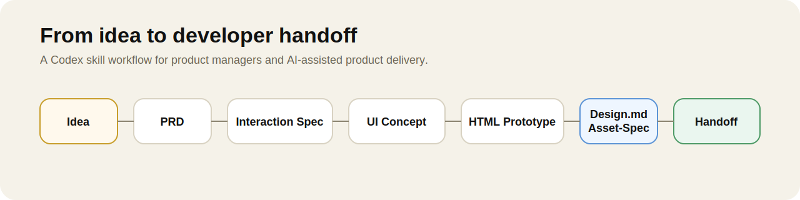
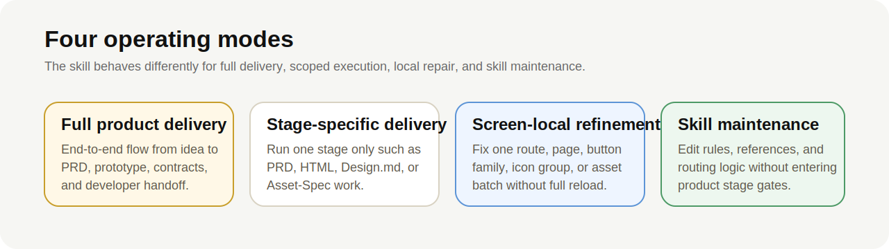
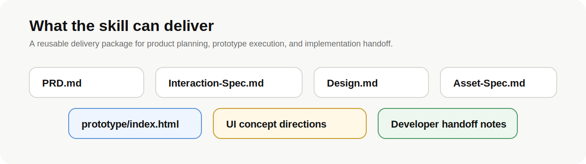

# Codex Skill for Product Managers

Turn rough product ideas into structured delivery artifacts with one reusable Codex skill.

This repository publishes a **Codex skill for product managers**. It is designed for **end-to-end product delivery work**: from product framing and PRD writing to interaction spec, UI direction, HTML prototype, `Design.md`, `Asset-Spec.md`, and developer handoff.



## What This Repository Is

- A **Codex skill**, not just a prompt collection.
- Built for **product managers, AI PM workflows, and product delivery collaboration**.
- Designed to support both **full workflow execution** and **scoped repair work**.
- Structured so the reusable mechanism stays in the skill while project-specific files stay in project folders.

## Why This Skill Exists

Product work often breaks between stages:

- requirements are written but are not implementation-ready
- UI ideas exist but are not translated into measurable prototype rules
- HTML is built without stable design or asset contracts
- project work gets repeated because standards live only inside one project

This skill exists to make the product-delivery chain reusable and operational inside Codex.

## What It Covers



### Full product delivery

Move from idea to handoff through a staged workflow:

`Idea -> PRD -> Interaction Spec -> UI Concept -> HTML Prototype -> Design.md -> Asset-Spec.md -> Developer Handoff`

### Stage-specific delivery

Use only one stage when needed, such as:

- PRD repair
- interaction repair
- UI concept work
- HTML prototype work
- design contract work
- asset contract work

### Screen-local refinement

Repair only one exact scope without reloading the whole workflow, for example:

- one screen
- one route
- one module
- one icon family
- one button family
- one asset batch

### Skill maintenance

Maintain the skill itself without triggering product-delivery stage gates.

## What This Skill Produces



Typical outputs include:

- `PRD.md`
- `Interaction-Spec.md`
- `UI concept directions`
- `Design.md`
- `Asset-Spec.md`
- `HTML prototypes`
- `Developer handoff notes`

## Why It Is Different From A Template Repo

- It routes requests by **work mode**, not by one static document template.
- It distinguishes **full delivery** from **one-screen repair**.
- It treats `Design.md` and `Asset-Spec.md` as **implementation contracts**, not optional notes.
- It keeps stage-gate confirmation for real product-delivery work while allowing continuous execution for skill maintenance.

## Best-Fit Use Cases

- turn a rough feature idea into a PRD and interaction spec
- create UI concept directions before prototyping
- build or repair high-fidelity HTML prototypes for phone, pad, TV, or web
- strengthen `Design.md` and `Asset-Spec.md` before asset replacement
- prepare developer handoff after product and prototype work are stable

## Install

### Install from GitHub into Codex

Current repository path:

```bash
python ~/.codex/skills/.system/skill-installer/scripts/install-skill-from-github.py \
  --repo znnti/AI-PM \
  --path skills/product-requirements-prototyper
```

After installing, restart Codex.

### Manual install

Copy this folder:

```text
skills/product-requirements-prototyper
```

into:

```text
~/.codex/skills/product-requirements-prototyper
```

Then restart Codex.

## Example Prompts

```text
Use product-requirements-prototyper to turn this product idea into a PRD and interaction spec.
```

```text
Use product-requirements-prototyper to create a high-fidelity HTML prototype for this iPad story app.
```

```text
Use product-requirements-prototyper to repair only index.html#home and update the relevant Design.md and Asset-Spec.md rules.
```

```text
Use product-requirements-prototyper to prepare developer handoff materials from the current prototype folder.
```

## Repository Structure

```text
.
├── README.md
├── LICENSE
├── assets/
│   └── readme/
└── skills/
    └── product-requirements-prototyper/
        ├── SKILL.md
        ├── agents/
        │   └── openai.yaml
        ├── references/
        └── assets/
```

## Recommended Repository Name

The current repository name `AI-PM` is short, but it does not explain the role fast enough for new visitors.

Recommended rename:

- `codex-product-delivery-skill`

Also good:

- `codex-pm-delivery-skill`
- `codex-skill-product-manager`

Why this matters:

- `Codex` should appear in the repository name
- `product delivery` or `product manager` should appear in the repository name
- visitors should understand within seconds that this is a **Codex skill for product delivery work**

## Skill Location

The actual published skill lives here:

- [skills/product-requirements-prototyper](./skills/product-requirements-prototyper/)

## Notes

- Keep project-specific decisions in project files, not in the skill.
- Keep skill references reusable and project-neutral.
- Stage Gate is preserved for actual product-delivery work.
- Skill maintenance should run continuously unless the user explicitly asks for step-by-step confirmation.
